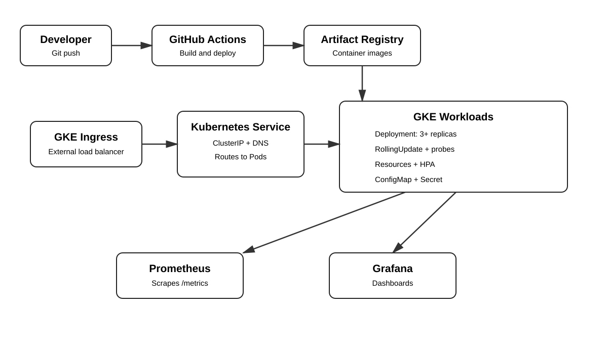

# GCP Cloud-Native Application Platform

A portfolio-ready cloud-native application platform built on **Google Cloud Platform** with **GKE, Kubernetes, Docker, Helm, GitHub Actions, Artifact Registry, Prometheus and Grafana**.

## Architecture



```text
Developer
   |
   v
GitHub -> GitHub Actions -> Docker -> Artifact Registry
                                      |
                                      v
Internet -> GKE Ingress -> Service -> Pods
                              |         |
                    ConfigMap/Secret    +-- Readiness/Liveness
                                        +-- Resources
                                        +-- HPA
                                        +-- /metrics
                                             |
                                         Prometheus
                                             |
                                          Grafana
```

## Project objectives

- Deploy a containerized web application to GKE.
- Use Kubernetes Deployments, Services, Ingress, ConfigMaps and Secrets.
- Implement rolling updates, health checks, resource requests/limits and HPA.
- Demonstrate Kubernetes service discovery and troubleshooting.
- Build Docker images and publish immutable versions to Artifact Registry.
- Automate build and deployment with GitHub Actions.
- Authenticate CI/CD to GCP using Workload Identity Federation instead of long-lived JSON keys.
- Monitor application and Kubernetes workloads with Prometheus and Grafana.

## Current GCP lab configuration

```text
Project ID: gcp-cloud-native-509022
Region:     asia-south1
Cluster:    cloud-native-cluster
Registry:   asia-south1-docker.pkg.dev/gcp-cloud-native-509022/cloud-native-app
Image:      web:v1
```

These values identify the lab resources and are **not credentials**. Never commit passwords, service-account JSON keys, access tokens or private keys.

## Repository structure

```text
.
├── app/
│   ├── server.py
│   └── requirements.txt
├── architecture/
│   └── architecture.svg
├── docker/
│   └── Dockerfile
├── kubernetes/
│   ├── namespace.yaml
│   ├── configmap.yaml
│   ├── secret.yaml
│   ├── deployment.yaml
│   ├── service.yaml
│   ├── ingress.yaml
│   ├── hpa.yaml
│   └── servicemonitor.yaml
├── helm/cloud-native-app/
│   ├── Chart.yaml
│   ├── values.yaml
│   └── templates/
├── monitoring/
│   ├── prometheus/README.md
│   └── grafana/README.md
├── tests/
├── docs/
└── .github/workflows/ci-cd.yaml
```

## Application endpoints

| Endpoint | Purpose |
|---|---|
| `/` | Application information |
| `/healthz` | Liveness probe |
| `/readyz` | Readiness probe |
| `/metrics` | Prometheus metrics |

## Deploy manually

Connect to GKE:

```powershell
gcloud config set project gcp-cloud-native-509022
gcloud container clusters get-credentials cloud-native-cluster --region asia-south1 --project gcp-cloud-native-509022
```

If the cluster was created as **zonal**, use its actual zone instead of `--region`.

Deploy the base Kubernetes resources:

```powershell
kubectl apply -f kubernetes/namespace.yaml
kubectl apply -f kubernetes/configmap.yaml
kubectl apply -f kubernetes/secret.yaml
kubectl apply -f kubernetes/deployment.yaml
kubectl apply -f kubernetes/service.yaml
kubectl apply -f kubernetes/hpa.yaml
kubectl apply -f kubernetes/ingress.yaml
```

Verify:

```powershell
kubectl get pods -n cloud-native -o wide
kubectl get svc -n cloud-native
kubectl get ingress -n cloud-native
kubectl get hpa -n cloud-native
```

## Helm deployment

```powershell
helm upgrade --install cloud-native-app ./helm/cloud-native-app `
  --namespace cloud-native `
  --create-namespace
```

Check the rollout:

```powershell
kubectl rollout status deployment/cloud-native-app-cloud-native-app -n cloud-native
```

## Docker

```powershell
docker build -f docker/Dockerfile -t cloud-native-app:local .
docker run --rm -p 8080:8080 cloud-native-app:local
```

## Testing

```powershell
python -m pip install -r app/requirements.txt
pytest -q
```

The tests validate the application's health, readiness, root endpoint and Prometheus metrics endpoint.

## CI/CD

GitHub Actions performs:

```text
Push to main
    |
    v
Python validation + tests
    |
    v
Helm lint
    |
    v
Docker build
    |
    v
Artifact Registry
    |
    v
GKE credentials
    |
    v
Helm upgrade/install
    |
    v
Rollout verification
```

Required GitHub repository variables:

```text
GCP_PROJECT_ID
GKE_CLUSTER
GKE_LOCATION
GAR_REGION
GAR_REPOSITORY
```

Required GitHub repository secrets:

```text
GCP_WORKLOAD_IDENTITY_PROVIDER
GCP_SERVICE_ACCOUNT
```

Use a dedicated GCP service account with least-privilege permissions. Do not upload a service-account JSON key.

## Monitoring

Install `kube-prometheus-stack` as described in `monitoring/prometheus/README.md`.

The application exposes Prometheus metrics through `/metrics`, and the Kubernetes ServiceMonitor is included in this repository.

Grafana can be accessed with:

```powershell
kubectl port-forward svc/monitoring-grafana 3000:80 -n monitoring
```

## Troubleshooting scenarios

The repository includes documented labs for:

- Failed Pods
- `CrashLoopBackOff`
- `ImagePullBackOff`
- Service discovery
- Application connectivity
- Rolling updates
- HPA behavior
- Ingress provisioning
- Prometheus/Grafana verification

See `docs/troubleshooting.md`.

## Security

- Containers run as a non-root user.
- Linux capabilities are dropped.
- Privilege escalation is disabled.
- Kubernetes resource limits are defined.
- Secrets are injected through Kubernetes Secret resources.
- CI/CD is designed around Workload Identity Federation.
- `.gitignore` excludes credential files and local state.

## Cost control

GKE nodes, external load balancers, Artifact Registry storage and monitoring can incur charges. This is a portfolio/lab environment, so delete unused resources when testing is complete.

## Portfolio skills demonstrated

**GCP:** GKE, Artifact Registry, IAM, Cloud networking

**Kubernetes:** Deployments, Services, Ingress, ConfigMaps, Secrets, Probes, HPA, ServiceMonitor, DNS/service discovery

**DevOps:** Docker, Helm, GitHub Actions, CI/CD, immutable image tagging, rollout verification

**Observability:** Prometheus, Grafana, application metrics, health checks

**Troubleshooting:** Pod failures, image pulls, service connectivity, scaling and ingress
